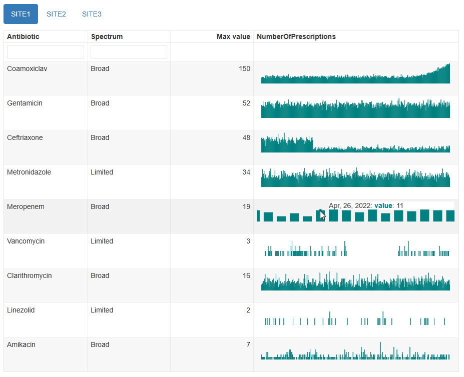
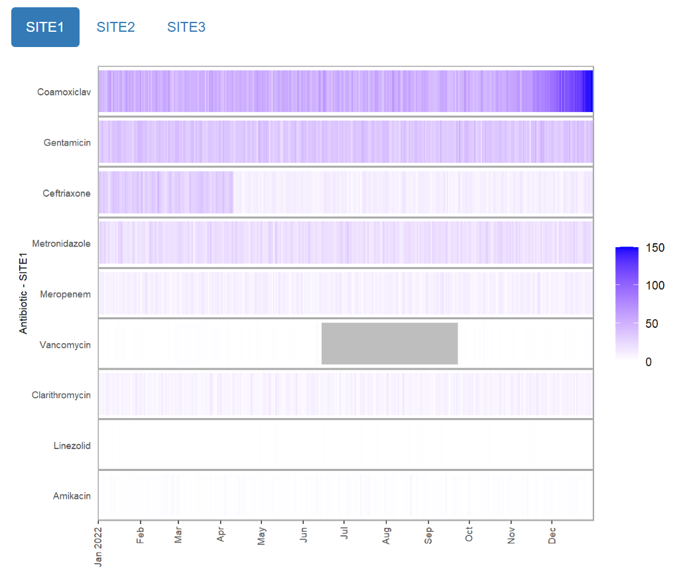

<!-- README.md is generated from README.Rmd. Please edit that file -->

# mantis

<!-- badges: start -->

[](https://www.repostatus.org/#active)
[](https://github.com/phuongquan/mantis/actions/workflows/R-CMD-check.yaml)
[](https://app.codecov.io/gh/phuongquan/mantis)
<!-- badges: end -->

The `mantis` package generates interactive reports that enable quick
visual review of multiple related time series. This can help with
identification of temporal artefacts and unexpected trends. The choice
of visualisations include interactive plots with adjustable axes and
tooltips showing the individual dates and values, as well as static
heatmap and scatter plots for more lightweight applications. E.g.



The resulting html reports are self-contained and shareable without a
web server.

`mantis` is designed for use on data that is essentially a collection of
time series in a data frame, where you have already decided which values
you are interested in reviewing. If you want to check more generally for
temporal changes in record-level, non-numeric data, then check out our
sister package
[‘daiquiri’](https://ropensci.github.io/daiquiri/index.html).

## Why should I use it?

We anticipate two main target users:

1.  Researchers who analyse data from large, temporal datasets,
    particularly routinely-collected data such as electronic health
    records. Included as part of the initial analysis stage, it will
    help you to check for any temporal biases in your datasets before
    embarking on your main analyses, therefore improving the reliability
    of your study.

2.  Managers of live data feeds that are used as a data source for
    downstream analyses. Regular inspection of data that is frequently
    updated will help to identify any issues early and enable a timely
    response to rectify issues such as missing data. While a set of
    validation checks in a data pipeline could also work in this
    circumstance, the benefit of this package is the ability to check
    for temporal anomalies that are obvious to the human eye but that
    are difficult to capture programmatically.

## Installation

``` r
# install dependencies first
install.packages(c(
  "remotes",
  "rmarkdown",
  "knitr",
  "reactable",
  "dplyr",
  "tidyr",
  "dygraphs",
  "xts",
  "ggplot2",
  "scales",
  "purrr",
  "htmltools"
))

# install the latest release version
remotes::install_github("phuongquan/mantis@v0.3.0", dependencies = FALSE)

# or install the current development version
# remotes::install_github("phuongquan/mantis", dependencies = FALSE)
```

## Usage

``` r
library(mantis)

# this example data frame contains numbers of antibiotic prescriptions 
# in long format
data("example_prescription_numbers")

head(example_prescription_numbers)
```

    ## # A tibble: 6 × 5
    ##   PrescriptionDate Antibiotic    Spectrum NumberOfPrescriptions Location
    ##   <date>           <chr>         <chr>                    <dbl> <chr>   
    ## 1 2022-01-01       Coamoxiclav   Broad                       45 SITE1   
    ## 2 2022-01-01       Gentamicin    Broad                       34 SITE1   
    ## 3 2022-01-01       Ceftriaxone   Broad                       36 SITE1   
    ## 4 2022-01-01       Metronidazole Limited                     17 SITE1   
    ## 5 2022-01-01       Meropenem     Broad                       10 SITE1   
    ## 6 2022-01-01       Vancomycin    Limited                      0 SITE1

``` r
# create a report in the current directory, with one tab per Location
mantis_report(
  df = example_prescription_numbers,
  inputspec = inputspec(
    timepoint_col = "PrescriptionDate",
    item_cols = c("Location", "Antibiotic", "Spectrum"),
    value_col = "NumberOfPrescriptions",
    tab_col = "Location",
    timepoint_unit = "day"
  )
)
```

Example reports and more detailed guidance can be found in the [package
website](https://phuongquan.github.io/mantis/index.html).

## Acknowledgements

This work was supported by the National Institute for Health Research
Health Protection Research Unit (NIHR HPRU) in Healthcare Associated
Infections and Antimicrobial Resistance at the University of Oxford in
partnership with the UK Health Security Agency (UKHSA) (NIHR200915), and
by the NIHR Oxford Biomedical Research Centre.

## Contributing to this package

Please report any bugs or suggestions by opening a [github
issue](https://github.com/phuongquan/mantis/issues).
