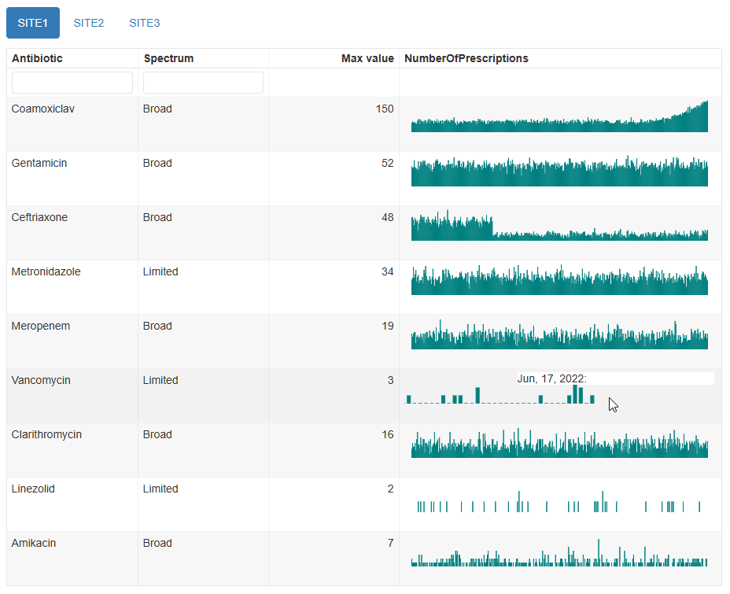

```{r, include = FALSE}
knitr::opts_chunk$set(
  collapse = TRUE,
  comment = "#>"
)
```

While visual inspection is probably the most reliable way of identifying anomalies in time series, things can be missed when there are large numbers of time series to inspect. In this case, it can be useful to additionally test the individual time series for certain conditions, such as the presence of missing values or for values breaching pre-set limits, and to alert the user to them.

The alerting rules functionality is currently only available for interactive outputs. They will be ignored when choosing static visualisations.

Note: This functionality is still in the early stages of development, and can increase the document size and rendering time of the report considerably.

## Overview

One or more alerting rules can be specified within an `alert_rules()` object, which is then passed into the `alert_rules` parameter.

## Built-in rules

There are a number of built-in rules that can be used to test for simple conditions, the simplest of which is testing for the presence of missing values. The `extent_type` and `extent_value` parameters can be used to adjust the tolerance. E.g.

```{r, eval=FALSE}
# alert if all values are NA
ars <- alert_rules(alert_missing(extent_type = "all"))

# alert if there are 10 or more missing values in total
# or if the last 3 or more values are missing
# or if 5 or more values in a row are missing
ars <- alert_rules(
  alert_missing(extent_type = "any", extent_value = 10),
  alert_missing(extent_type = "last", extent_value = 3),
  alert_missing(extent_type = "consecutive", extent_value = 5)
)
```


The `alert_equals()`, `alert_below()`, `alert_above()` rules work similarly, but with an extra parameter `rule_value` to compare against.

It is also possible to compare a range of values with another range of values using the `alert_difference_above_perc()` and `alert_difference_below_perc()` rules. This can be useful for checking if recent values are lower/higher than in a previous period, over a particular percentage. This comparison is based on the mean of values in the two periods. The ranges should be contiguous, and denote positions from the end of the time series. E.g.

```{r, eval=FALSE}
# alert if the mean of last 3 values is more than 20% higher than the mean of the preceding 12 values
ars <- alert_rules(
  alert_difference_above_perc(current_period = 1:3, previous_period = 4:15, rule_value = 20)
)
```


## Custom rules

If you want to apply a more complex rule, you can specify your own using `alert_custom()`. E.g.

```{r, eval=FALSE}
ars <- alert_rules(
  alert_custom(
    short_name = "my_rule_combo",
    description = "Over 3 missing values and max value is > 10",
    function_call = quote(sum(is.na(value)) > 3 && max(value, na.rm = TRUE) > 10)
  ),
  alert_custom(
    short_name = "my_rule_doubled",
    description = "Last value is over double the first value",
    function_call = quote(rev(value)[1] > 2*value[1])
  )
)
```

The function_call is evaluated per time series, and the expression inside `quote()` must return either `TRUE` or `FALSE`. A return value of `TRUE` means the alert result is "FAIL"

Column names that can be used explicitly in the expression are: `value`, `item`, `timepoint`; and which refer to the values in the `value_col`, `item_col`, `timepoint_col` columns of the data respectively. Before evaluating the `function_call`, the dataframe is grouped by the `item_col` and ordered by the `timepoint_col`.

## Applying different rules to different time series

By default, the specified rules will be run on all time series in the supplied dataframe. You can specify different sets of rules for different time series by providing a vector of the `item_col` values that the particular rule should be applied to in the `items` parameter.

## Walkthrough 

Generate an interactive `mantis` report for the `example_prescription_numbers` dataset supplied with the `mantis` package.

```{r}
library(mantis)

data("example_prescription_numbers")

```

```{r, eval=FALSE}
mantis_report(
  df = example_prescription_numbers,
  inputspec = inputspec(
    timepoint_col = "PrescriptionDate",
    item_col = "Antibiotic",
    value_col = "NumberOfPrescriptions",
    tab_col = "Location"
  ),
  outputspec = outputspec_interactive(
    item_label = "Antibiotic",
    sync_axis_range = FALSE
  ),
  report_title = "mantis report",
  dataset_description = "Antibiotic prescriptions by site",
  save_filename = "example_prescription_numbers_interactive",
  show_progress = TRUE
)
```

In the SITE1 tab, the Vancomycin time series contains a block of NA values but it is not easy to distinguish between NA values and zero values unless you zoom in on the plot (by selecting a section of it with the mouse) or hover the mouse over the relevant time points and read the tooltips.



We can easily add a rule to test for any missing values. While we're here, we will also add a custom rule to try to catch the fact that Coamoxiclav prescriptions have become much higher than they were at the start.

```{r, eval=FALSE}
ars <- alert_rules(
  alert_missing(extent_type = "any", extent_value = 1),
  alert_custom(
    short_name = "my_rule_doubled",
    description = "Last 7 values are over double the first 7 values",
    function_call = quote(mean(rev(value)[1:7], na.rm = TRUE) > 2*(mean(value[1:7], na.rm = TRUE)))
  )
)

# create a new report
mantis_report(
  df = example_prescription_numbers,
  inputspec = inputspec(
    timepoint_col = "PrescriptionDate",
    item_col = "Antibiotic",
    value_col = "NumberOfPrescriptions",
    tab_col = "Location"
  ),
  outputspec = outputspec_interactive(
    item_label = "Antibiotic",
    sync_axis_range = FALSE
  ),
  alert_rules = ars,
  report_title = "mantis report with alerts",
  dataset_description = "Antibiotic prescriptions by site",
  save_filename = "example_prescription_numbers_interactive_alerts",
  show_progress = TRUE
)

```

The report now includes a column for the alert results, and details can be seen by clicking on the triangles. Also, the tab label includes an exclamation mark if any items in that tab have failed an alert rule.


