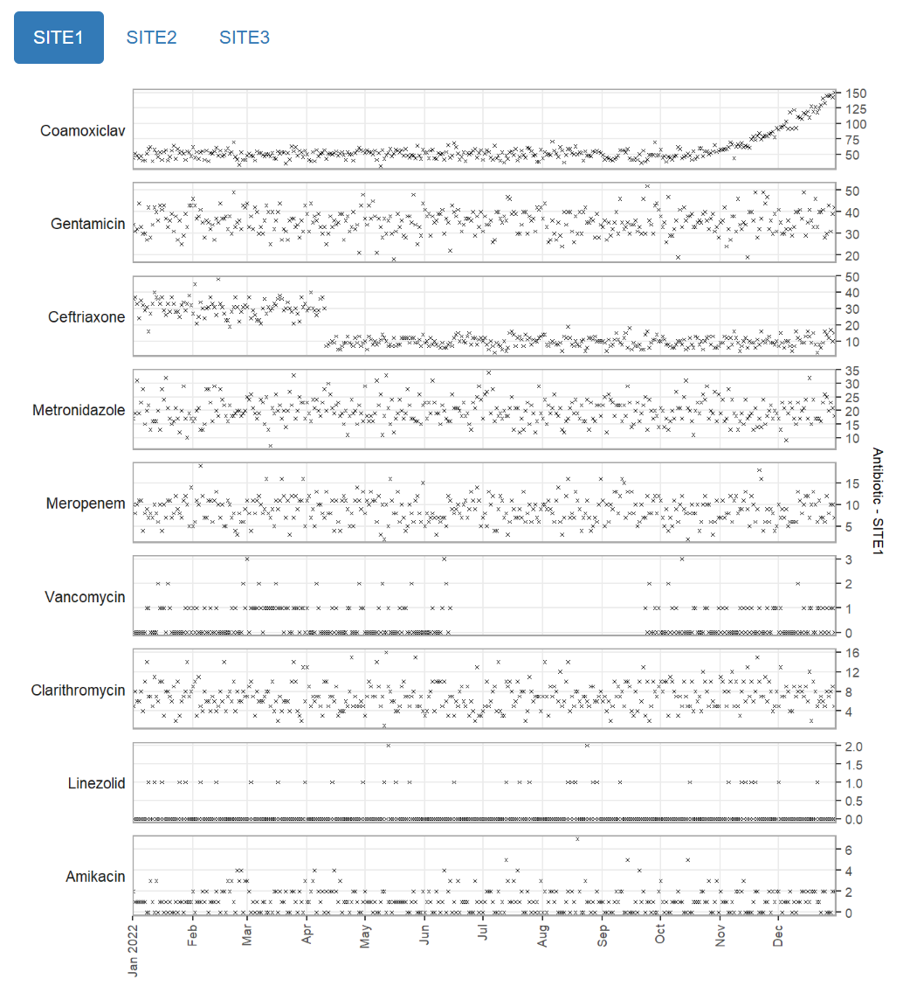

```{r, include = FALSE}
knitr::opts_chunk$set(
  collapse = TRUE,
  comment = "#>"
)
```

This vignette demonstrates how to use this package to generate different types of html reports that allow you to visually review multiple related time series quickly and easily.

## Data format

The data frame containing the time series should be in long format, with the following columns (though the actual column names can be different):

* one "timepoint" (date) column which will be used for the x-axes. Values should have a regular periodicity, e.g. daily, but do not have to be consecutive.
* one or more "item" (character) columns containing categorical values identifying distinct time series.
* one "value" (numeric) column containing the time series values which will be used for the y-axes.

**Example:**

The `example_prescription_numbers` dataset is provided with this package, and contains (synthetic) examples of aggregate numbers of antibiotic prescriptions given in a hospital over a period of a year. It contains 5 columns:

* PrescriptionDate - The date the prescriptions were written
* Antibiotic - The name of the antibiotic prescribed
* Spectrum - The spectrum of activity of the antibiotic. This value is always the same for a particular antibiotic
* NumberOfPrescriptions - The number of prescriptions written for this antibiotic on this day
* Location - The hospital site where the prescription was written

```{r data}
# first, attach the package if you haven't already
library(mantis)

# this example data frame contains numbers of antibiotic prescriptions in long format
data("example_prescription_numbers")

head(example_prescription_numbers)
```

### Specifying the data columns

You must specify which column(s) in the supplied data frame should be used to identify the individual time series (items), and which columns contain the timepoint (x-axis) and value (y-axis) for the time series. These are set using the `item_cols`, `timepoint_col` and `value_col` parameters of `inputspec()` respectively. Any other columns in the data frame are ignored.

Optionally, if there are multiple columns specified in `item_cols`, one of them can be used to group the time series into different tabs on the report, by using the `tab_col` parameter.

Members of `item_cols` should be specified in the order that you want them to appear in the output.

**Example:**

For the `example_prescription_numbers` dataset above, the combination of "Antibiotic" and "Location" columns uniquely identify a time series in the data frame, and so both columns must be included in `item_cols`.

The "Spectrum" column can also be added to `item_cols` as well if desired, in which case it will appear in the output as an additional column/label. Otherwise it will be ignored.

Here are some options for specifying the data columns, depending on how you want the report to look:

```{r}

# create a flat report, and include the "Location" and "Antibiotic" fields in the content
inspec_flat <- inputspec(
  timepoint_col = "PrescriptionDate",
  item_cols = c("Location", "Antibiotic"),
  value_col = "NumberOfPrescriptions"
)

# create a flat report, and include the "Location", "Spectrum", and "Antibiotic" fields in the
# content
inspec_flat2 <- inputspec(
  timepoint_col = "PrescriptionDate",
  item_cols = c("Location", "Spectrum", "Antibiotic"),
  value_col = "NumberOfPrescriptions"
)

# create a tabbed report, with a separate tab for each unique value of "Location", and include just
# the "Antibiotic" field in the content of each tab
inspec_tabbed <- inputspec(
  timepoint_col = "PrescriptionDate",
  item_cols = c("Antibiotic", "Location"),
  value_col = "NumberOfPrescriptions",
  tab_col = "Location"
)

# create a tabbed report, with a separate tab for each unique value of "Location", and include the
# "Antibiotic" and "Spectrum" fields in the content of each tab
inspec_tabbed2 <- inputspec(
  timepoint_col = "PrescriptionDate",
  item_cols = c("Antibiotic", "Spectrum", "Location"),
  value_col = "NumberOfPrescriptions",
  tab_col = "Location"
)

# create a tabbed report, with a separate tab for each unique value of "Antibiotic", and include
# just the "Location" field in the content of each tab
inspec_tabbed3 <- inputspec(
  timepoint_col = "PrescriptionDate",
  item_cols = c("Antibiotic", "Location"),
  value_col = "NumberOfPrescriptions",
  tab_col = "Antibiotic"
)

```


## Generating a report

The simplest way to create a report is to use the `mantis_report()` function. 

We need to decide where to save the report, and optionally specify a filename (excluding file extension). The filename can only contain alphanumeric, `-` and `_` characters. If a filename is not supplied, one will be automatically generated. We can also optionally specify a short description for the dataset, which will appear on the report.

There are 3 different options for visualising the time series. This is set using the `outputspec` parameter.

### Interactive plots

This is the default visualisation, and produces a table with one time series in each row, with orderable and filterable columns showing the previously-specified `item_cols` for identifying the time series. Also in the table are the maximum value of each time series, and bar plots with adjustable axes and tooltips showing the individual dates and values.

There are some options for adjusting the output, such as changing column labels, plot type, and whether or not to use the same y-axis scale across the table. This can be done using the `outputspec_interactive()` function when supplying the `outputspec` parameter.

**Example:**

For the `example_prescription_numbers` dataset above, we will save a report in the current directory, with separate tabs for each hospital site.

```{r interactive-test, include=FALSE}
# quietly test can create the report from an rmd but show the code in the next chunk in the vignette
filename <- 
  mantis_report(
  df = example_prescription_numbers,
  inputspec = inspec_tabbed2,
  outputspec = outputspec_interactive(),
  report_title = "mantis report",
  dataset_description = "Antibiotic prescriptions by site",
  save_filename = "example_prescription_numbers_interactive",
  show_progress = FALSE
)

# clean up
file.remove(filename)
```

```{r interactive-display, eval=FALSE}
mantis_report(
  df = example_prescription_numbers,
  inputspec = inspec_tabbed2,
  outputspec = outputspec_interactive(),
  report_title = "mantis report",
  dataset_description = "Antibiotic prescriptions by site",
  save_filename = "example_prescription_numbers_interactive",
  show_progress = TRUE
)
```


### Static plots

Alternatively, the report can output static plots. This can be useful if interactivity is not needed, or if file sizes need to be kept small. There are currently two types of static visualisations: heatmap or multipanel, and are selected by using the `outputspec_static_heatmap()` or `outputspec_static_multipanel()` function when supplying the `outputspec` parameter.

#### Heatmap

```{r heatmap-test, include=FALSE}
# quietly test can create the report from an rmd but show the code in the next chunk in the vignette
filename <- 
  mantis_report(
  df = example_prescription_numbers,
  inputspec = inspec_tabbed,
  outputspec = outputspec_static_heatmap(),
  report_title = "mantis report",
  dataset_description = "Antibiotic prescriptions by site",
  save_filename = "example_prescription_numbers_heatmap",
  show_progress = FALSE
)

# clean up
file.remove(filename)
```

```{r heatmap-display, eval=FALSE}
mantis_report(
  df = example_prescription_numbers,
  inputspec = inspec_tabbed,
  outputspec = outputspec_static_heatmap(),
  report_title = "mantis report",
  dataset_description = "Antibiotic prescriptions by site",
  save_filename = "example_prescription_numbers_heatmap",
  show_progress = TRUE
)
```


#### Multipanel

```{r multipanel-test, include=FALSE}
# quietly test can create the report from an rmd but show the code in the next chunk in the vignette
filename <- 
  mantis_report(
  df = example_prescription_numbers,
  inputspec = inspec_tabbed,
  outputspec = outputspec_static_multipanel(),
  report_title = "mantis report",
  dataset_description = "Antibiotic prescriptions by site",
  save_filename = "example_prescription_numbers_multipanel",
  show_progress = FALSE
)

# clean up
file.remove(filename)
```

```{r multipanel-display, eval=FALSE}
mantis_report(
  df = example_prescription_numbers,
  inputspec = inspec_tabbed,
  outputspec = outputspec_static_multipanel(),
  report_title = "mantis report",
  dataset_description = "Antibiotic prescriptions by site",
  save_filename = "example_prescription_numbers_multipanel",
  show_progress = TRUE
)
```


