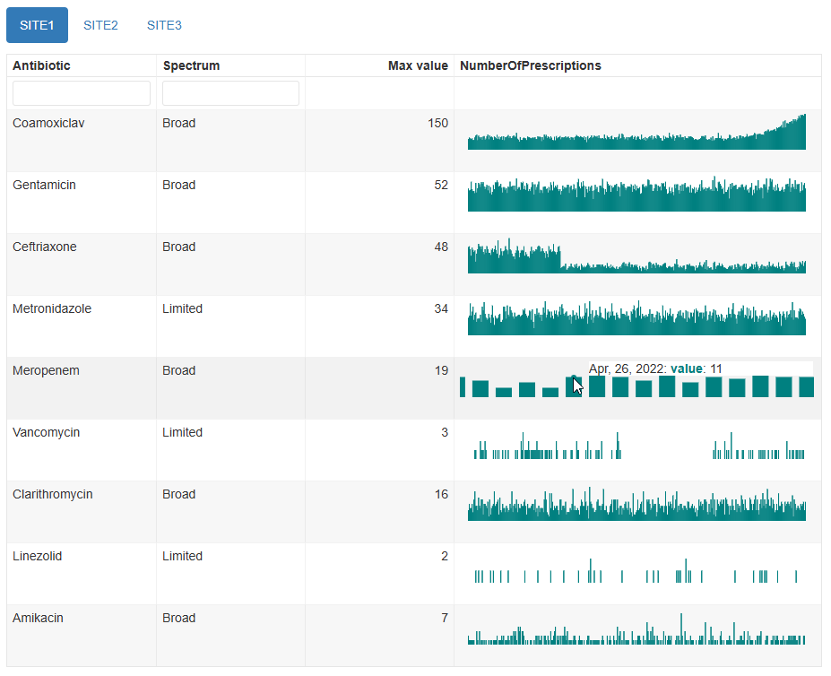
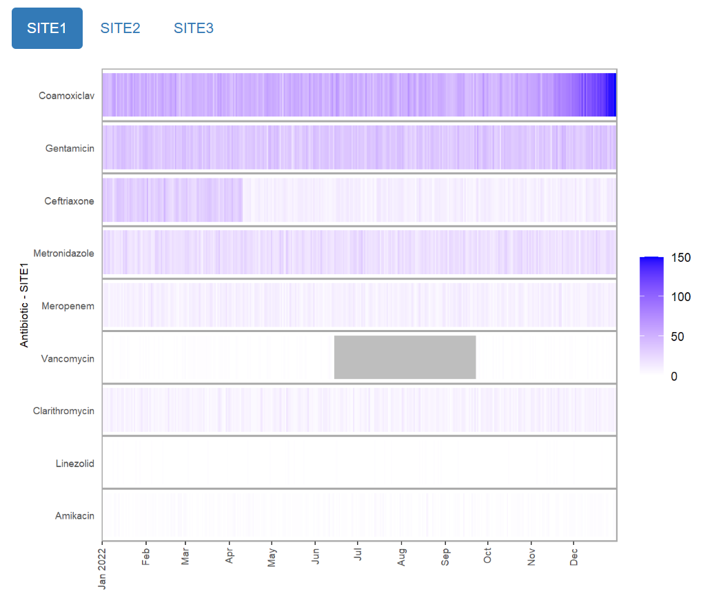

```{r, include = FALSE}
knitr::opts_chunk$set(
  collapse = TRUE,
  comment = "#>"
)
```

This vignette demonstrates how to use this package to generate different types of html reports that allow you to visually review multiple related time series quickly and easily.

## Data format

The data frame containing the time series should be in long format, with the following columns (though the actual column names can be different):

* one "timepoint" (date) column which will be used for the x-axes. This currently must be at a daily granularity, but values do not have to be consecutive.
* one "item" (character) column containing categorical values identifying distinct time series.
* one "value" (numeric) column containing the time series values which will be used for the y-axes.
* Optionally, a "tab" (character) column containing categorical values which will be used to group the time series into different tabs on the report.

**Example:**

The `example_prescription_numbers` dataset is provided with this package, and contains (synthetic) examples of aggregate numbers of antibiotic prescriptions given in a hospital over a period of a year. It contains 4 columns:

* PrescriptionDate - The date the prescriptions were written
* Antibiotic - The name of the antibiotic prescribed
* NumberOfPrescriptions - The number of prescriptions written for this antibiotic on this day
* Location - The hospital site where the prescription was written

TODO: Columns that can or can't contain NA values

```{r data}
# first, attach the package if you haven't already
library(mantis)

# this example data frame contains numbers of antibiotic prescriptions in long format, 
#   plus a column for grouping the output:
data("example_prescription_numbers")

head(example_prescription_numbers)
```

## Generating a report

The simplest way to create a report is to use the `mantis_report()` function. 

We need to decide where to save the report, and optionally specify a filename (excluding file extension). The filename can only contain alphanumeric, `-` and `_` characters. If a filename is not supplied, one will be automatically generated. We can also optionally specify a short description for the dataset, which will appear on the report.

The `inputspec` parameter specifies which columns in the supplied data frame contain the timepoint (x-axis), item (time series identifer), and value (y-axis) for the time series. If a tab column is specified, items sharing the same tab value will be grouped together on separate tabs in the report.

There are 3 different options for visualising the time series. This is set using the `outputspec` parameter.

### Interactive plots

This is the default visualisation, and produces a table with one time series in each row, with orderable and filterable columns showing the name of the time series, its maximum value, and a bar plot with adjustable axes and tooltips showing the individual dates and values.

There are some options for adjusting the output, such as changing column labels, plot type, and whether or not to use the same y-axis scale across the table. This can be done using the `outputspec_interactive()` function when supplying the `outputspec` parameter.

**Example:**

For the `example_prescription_numbers` dataset above, we will save a report in the current directory, with separate tabs for each hospital site, and changing the first column header to be "Antibiotic".

```{r interactive-test, include=FALSE}
# quietly test can create the report from an rmd but show the code in the next chunk in the vignette
filename <- 
  mantis_report(
  df = example_prescription_numbers,
  inputspec = inputspec(
    timepoint_col = "PrescriptionDate",
    item_col = "Antibiotic",
    value_col = "NumberOfPrescriptions",
    tab_col = "Location"
  ),
  outputspec = outputspec_interactive(
    item_label = "Antibiotic",
    sync_axis_range = FALSE
  ),
  report_title = "mantis report",
  dataset_description = "Antibiotic prescriptions by site",
  save_filename = "example_prescription_numbers_interactive",
  show_progress = FALSE
)

# clean up
file.remove(filename)
```

```{r interactive-display, eval=FALSE}
mantis_report(
  df = example_prescription_numbers,
  inputspec = inputspec(
    timepoint_col = "PrescriptionDate",
    item_col = "Antibiotic",
    value_col = "NumberOfPrescriptions",
    tab_col = "Location"
  ),
  outputspec = outputspec_interactive(
    item_label = "Antibiotic",
    sync_axis_range = FALSE
  ),
  report_title = "mantis report",
  dataset_description = "Antibiotic prescriptions by site",
  save_filename = "example_prescription_numbers_interactive",
  show_progress = TRUE
)
```



### Static plots

Alternatively, the report can output static plots. This can be useful if interactivity is not needed, or if file sizes need to be kept small. There are currently two types of static visualisations: heatmap or multipanel, and are selected by using the `outputspec_static_heatmap()` or `outputspec_static_multipanel()` function when supplying the `outputspec` parameter.

#### Heatmap

```{r heatmap-test, include=FALSE}
# quietly test can create the report from an rmd but show the code in the next chunk in the vignette
filename <- 
  mantis_report(
  df = example_prescription_numbers,
  inputspec = inputspec(
    timepoint_col = "PrescriptionDate",
    item_col = "Antibiotic",
    value_col = "NumberOfPrescriptions",
    tab_col = "Location"
  ),
  outputspec = outputspec_static_heatmap(
    y_label = "Antibiotic"
  ),
  report_title = "mantis report",
  dataset_description = "Antibiotic prescriptions by site",
  save_filename = "example_prescription_numbers_heatmap",
  show_progress = FALSE
)

# clean up
file.remove(filename)
```

```{r heatmap-display, eval=FALSE}
mantis_report(
  df = example_prescription_numbers,
  inputspec = inputspec(
    timepoint_col = "PrescriptionDate",
    item_col = "Antibiotic",
    value_col = "NumberOfPrescriptions",
    tab_col = "Location"
  ),
  outputspec = outputspec_static_heatmap(
    y_label = "Antibiotic"
  ),
  report_title = "mantis report",
  dataset_description = "Antibiotic prescriptions by site",
  save_filename = "example_prescription_numbers_heatmap",
  show_progress = TRUE
)
```



#### Multipanel

```{r multipanel-test, include=FALSE}
# quietly test can create the report from an rmd but show the code in the next chunk in the vignette
filename <- 
  mantis_report(
  df = example_prescription_numbers,
  inputspec = inputspec(
    timepoint_col = "PrescriptionDate",
    item_col = "Antibiotic",
    value_col = "NumberOfPrescriptions",
    tab_col = "Location"
  ),
  outputspec = outputspec_static_multipanel(
    y_label = "Antibiotic"
  ),
  report_title = "mantis report",
  dataset_description = "Antibiotic prescriptions by site",
  save_filename = "example_prescription_numbers_multipanel",
  show_progress = FALSE
)

# clean up
file.remove(filename)
```

```{r multipanel-display, eval=FALSE}
mantis_report(
  df = example_prescription_numbers,
  inputspec = inputspec(
    timepoint_col = "PrescriptionDate",
    item_col = "Antibiotic",
    value_col = "NumberOfPrescriptions",
    tab_col = "Location"
  ),
  outputspec = outputspec_static_multipanel(
    y_label = "Antibiotic"
  ),
  report_title = "mantis report",
  dataset_description = "Antibiotic prescriptions by site",
  save_filename = "example_prescription_numbers_multipanel",
  show_progress = TRUE
)
```


